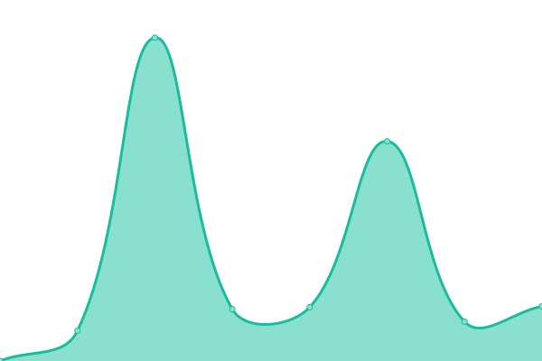
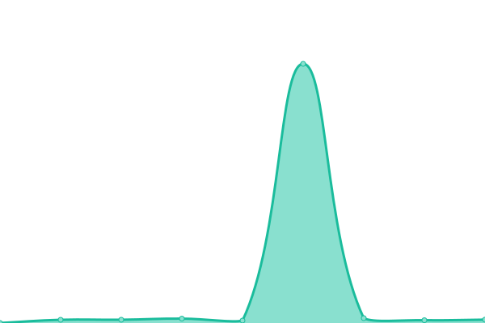

# [📈 Live Status](https://jpleasants.github.io/plesk3): <!--live status--> **🟧 Partial outage**

This repository contains the open-source uptime monitor and status page for [jpleasants](https://jpleasants.github.io/plesk3), powered by [Upptime](https://github.com/upptime/upptime).

With [Upptime](https://upptime.js.org), you can get your own unlimited and free uptime monitor and status page, powered entirely by a GitHub repository. We use [Issues](https://github.com/jpleasants/plesk3/issues) as incident reports, [Actions](https://github.com/jpleasants/plesk3/actions) as uptime monitors, and [Pages](https://jpleasants.github.io/plesk3) for the status page.

<!--start: status pages-->
<!-- This summary is generated by Upptime (https://github.com/upptime/upptime) -->
<!-- Do not edit this manually, your changes will be overwritten -->
<!-- prettier-ignore -->
| URL | Status | History | Response Time | Uptime |
| --- | ------ | ------- | ------------- | ------ |
|  [Plesk 3](https://plesk3.samitsolutions.com) | 🟩 Up | [plesk-3.yml](https://github.com/jpleasants/plesk3/commits/HEAD/history/plesk-3.yml) | 

 103ms
     
 | 

<a href="https://jpleasants.github.io/plesk3/history/plesk-3">100.00%</a>
    

|  [Aexelar](https://aexelar.com) | 🟩 Up | [aexelar.yml](https://github.com/jpleasants/plesk3/commits/HEAD/history/aexelar.yml) | 

 406ms
     
 | 

<a href="https://jpleasants.github.io/plesk3/history/aexelar">100.00%</a>
    

|  [Bharat Grocery](https://bharat-grocery.com) | 🟩 Up | [bharat-grocery.yml](https://github.com/jpleasants/plesk3/commits/HEAD/history/bharat-grocery.yml) | 

 452ms
     
 | 

<a href="https://jpleasants.github.io/plesk3/history/bharat-grocery">100.00%</a>
    

|  [Carolina Heart Center](https://carolinaheartcenter.com) | 🟩 Up | [carolina-heart-center.yml](https://github.com/jpleasants/plesk3/commits/HEAD/history/carolina-heart-center.yml) | 

 101ms
     
 | 

<a href="https://jpleasants.github.io/plesk3/history/carolina-heart-center">100.00%</a>
    

|  [Control Infotech](https://control-infotech.com) | 🟩 Up | [control-infotech.yml](https://github.com/jpleasants/plesk3/commits/HEAD/history/control-infotech.yml) | 

 168ms
     
 | 

<a href="https://jpleasants.github.io/plesk3/history/control-infotech">100.00%</a>
    

|  [Durant Rd Pediatrics](https://drpeds.com) | 🟩 Up | [durant-rd-pediatrics.yml](https://github.com/jpleasants/plesk3/commits/HEAD/history/durant-rd-pediatrics.yml) | 

 5041ms
     
 | 

<a href="https://jpleasants.github.io/plesk3/history/durant-rd-pediatrics">100.00%</a>
    

|  [Coalition For Carolina Foundation](https://coalitionforcarolinafoundation.org) | 🟩 Up | [coalition-for-carolina-foundation.yml](https://github.com/jpleasants/plesk3/commits/HEAD/history/coalition-for-carolina-foundation.yml) | 

 720ms
     
 | 

<a href="https://jpleasants.github.io/plesk3/history/coalition-for-carolina-foundation">100.00%</a>
    

|  [Crowdsourcing Sustainability](https://crowdsourcingsustainability.org) | 🟩 Up | [crowdsourcing-sustainability.yml](https://github.com/jpleasants/plesk3/commits/HEAD/history/crowdsourcing-sustainability.yml) | 

 505ms
     
 | 

<a href="https://jpleasants.github.io/plesk3/history/crowdsourcing-sustainability">100.00%</a>
    

|  [KANORS EMR Forum](https://forum.kanors-emr.org) | 🟩 Up | [kanors-emr-forum.yml](https://github.com/jpleasants/plesk3/commits/HEAD/history/kanors-emr-forum.yml) | 

 1260ms
     
 | 

<a href="https://jpleasants.github.io/plesk3/history/kanors-emr-forum">100.00%</a>
    

|  [Fresh Indian Market](https://freshindianmarket.com) | 🟩 Up | [fresh-indian-market.yml](https://github.com/jpleasants/plesk3/commits/HEAD/history/fresh-indian-market.yml) | 

 92ms
     
 | 

<a href="https://jpleasants.github.io/plesk3/history/fresh-indian-market">100.00%</a>
    

|  [Harbor Hat](https://harborhat.com) | 🟩 Up | [harbor-hat.yml](https://github.com/jpleasants/plesk3/commits/HEAD/history/harbor-hat.yml) | 

 960ms
     
 | 

<a href="https://jpleasants.github.io/plesk3/history/harbor-hat">100.00%</a>
    

|  [KANORS EMR Helpdesk](https://helpdesk.kanors-emr.org) | 🟩 Up | [kanors-emr-helpdesk.yml](https://github.com/jpleasants/plesk3/commits/HEAD/history/kanors-emr-helpdesk.yml) | 

 368ms
     
 | 

<a href="https://jpleasants.github.io/plesk3/history/kanors-emr-helpdesk">100.00%</a>
    

|  [Institrve](https://institrve.com) | 🟩 Up | [institrve.yml](https://github.com/jpleasants/plesk3/commits/HEAD/history/institrve.yml) | 

 483ms
     
 | 

<a href="https://jpleasants.github.io/plesk3/history/institrve">100.00%</a>
    

|  [KANORS EMR](https://kanors-emr.org) | 🟩 Up | [kanors-emr.yml](https://github.com/jpleasants/plesk3/commits/HEAD/history/kanors-emr.yml) | 

 1931ms
     
 | 

<a href="https://jpleasants.github.io/plesk3/history/kanors-emr">100.00%</a>
    

|  [Khanna Sons Jewelers](https://khannasonsjewelers.com) | 🟩 Up | [khanna-sons-jewelers.yml](https://github.com/jpleasants/plesk3/commits/HEAD/history/khanna-sons-jewelers.yml) | 

 96ms
     
 | 

<a href="https://jpleasants.github.io/plesk3/history/khanna-sons-jewelers">100.00%</a>
    

|  [KANORS EMR Licensing](https://licensing.kanors-emr.org) | 🟩 Up | [kanors-emr-licensing.yml](https://github.com/jpleasants/plesk3/commits/HEAD/history/kanors-emr-licensing.yml) | 

 347ms
     
 | 

<a href="https://jpleasants.github.io/plesk3/history/kanors-emr-licensing">100.00%</a>
    

|  [Lj Neurology](https://ljneurology.com) | 🟩 Up | [lj-neurology.yml](https://github.com/jpleasants/plesk3/commits/HEAD/history/lj-neurology.yml) | 

 713ms
     
 | 

<a href="https://jpleasants.github.io/plesk3/history/lj-neurology">100.00%</a>
    

|  [Marizyme](https://marizyme.com) | 🟩 Up | [marizyme.yml](https://github.com/jpleasants/plesk3/commits/HEAD/history/marizyme.yml) | 

 96ms
     
 | 

<a href="https://jpleasants.github.io/plesk3/history/marizyme">100.00%</a>
    

|  [My Medical Idea](https://mymedicalidea.com) | 🟩 Up | [my-medical-idea.yml](https://github.com/jpleasants/plesk3/commits/HEAD/history/my-medical-idea.yml) | 

 92ms
     
 | 

<a href="https://jpleasants.github.io/plesk3/history/my-medical-idea">100.00%</a>
    

|  [Nazara NC](https://nazaranc.com) | 🟩 Up | [nazara-nc.yml](https://github.com/jpleasants/plesk3/commits/HEAD/history/nazara-nc.yml) | 

 95ms
     
 | 

<a href="https://jpleasants.github.io/plesk3/history/nazara-nc">100.00%</a>
    

|  [peppernc](https://peppernc.com) | 🟩 Up | [peppernc.yml](https://github.com/jpleasants/plesk3/commits/HEAD/history/peppernc.yml) | 

 97ms
     
 | 

<a href="https://jpleasants.github.io/plesk3/history/peppernc">100.00%</a>
    

|  [Shah and Associated FP Portal](https://portal.shahandassociatesfp.com) | 🟩 Up | [shah-and-associated-fp-portal.yml](https://github.com/jpleasants/plesk3/commits/HEAD/history/shah-and-associated-fp-portal.yml) | 

 90ms
     
 | 

<a href="https://jpleasants.github.io/plesk3/history/shah-and-associated-fp-portal">100.00%</a>
    

|  [Serge Tech Mechanical](https://sergetechmechanical.com) | 🟩 Up | [serge-tech-mechanical.yml](https://github.com/jpleasants/plesk3/commits/HEAD/history/serge-tech-mechanical.yml) | 

 1557ms
     
 | 

<a href="https://jpleasants.github.io/plesk3/history/serge-tech-mechanical">100.00%</a>
    

|  [Shah and Associated FP](https://shahandassociatesfp.com) | 🟩 Up | [shah-and-associated-fp.yml](https://github.com/jpleasants/plesk3/commits/HEAD/history/shah-and-associated-fp.yml) | 

 86ms
     
 | 

<a href="https://jpleasants.github.io/plesk3/history/shah-and-associated-fp">100.00%</a>
    

|  [Shivji Photography](https://shivji.photography) | 🟩 Up | [shivji-photography.yml](https://github.com/jpleasants/plesk3/commits/HEAD/history/shivji-photography.yml) | 

 333ms
     
 | 

<a href="https://jpleasants.github.io/plesk3/history/shivji-photography">100.00%</a>
    

|  [Pickles And Play](https://picklesandplay.com) | 🟩 Up | [pickles-and-play.yml](https://github.com/jpleasants/plesk3/commits/HEAD/history/pickles-and-play.yml) | 

 462ms
     
 | 

<a href="https://jpleasants.github.io/plesk3/history/pickles-and-play">100.00%</a>
    

|  [Sleep Clinic Of Ohio](https://sleepclinicofohio.com) | 🟥 Down | [sleep-clinic-of-ohio.yml](https://github.com/jpleasants/plesk3/commits/HEAD/history/sleep-clinic-of-ohio.yml) | 

 0ms
     
 | 

<a href="https://jpleasants.github.io/plesk3/history/sleep-clinic-of-ohio">0.00%</a>
    

|  [Thepuppie](https://thepuppie.com) | 🟩 Up | [thepuppie.yml](https://github.com/jpleasants/plesk3/commits/HEAD/history/thepuppie.yml) | 

 435ms
     
 | 

<a href="https://jpleasants.github.io/plesk3/history/thepuppie">100.00%</a>
    

|  [Stone ERP](https://stone-erp.com) | 🟩 Up | [stone-erp.yml](https://github.com/jpleasants/plesk3/commits/HEAD/history/stone-erp.yml) | 

 99ms
     
 | 

<a href="https://jpleasants.github.io/plesk3/history/stone-erp">100.00%</a>
    

|  [KANORS EMR Support](https://support.kanors-emr.org) | 🟩 Up | [kanors-emr-support.yml](https://github.com/jpleasants/plesk3/commits/HEAD/history/kanors-emr-support.yml) | 

 1341ms
     
 | 

<a href="https://jpleasants.github.io/plesk3/history/kanors-emr-support">100.00%</a>
    

|  [wfendo.com](https://wfendo.com) | 🟩 Up | [wfendo-com.yml](https://github.com/jpleasants/plesk3/commits/HEAD/history/wfendo-com.yml) | 

 80ms
     
 | 

<a href="https://jpleasants.github.io/plesk3/history/wfendo-com">100.00%</a>
    

|  [Zaykaunc Chapelhill](https://zaykauncchapelhill.com) | 🟩 Up | [zaykaunc-chapelhill.yml](https://github.com/jpleasants/plesk3/commits/HEAD/history/zaykaunc-chapelhill.yml) | 

 376ms
     
 | 

<a href="https://jpleasants.github.io/plesk3/history/zaykaunc-chapelhill">100.00%</a>
    

|  [Veear Projects](https://veearprojects.com) | 🟩 Up | [veear-projects.yml](https://github.com/jpleasants/plesk3/commits/HEAD/history/veear-projects.yml) | 

 789ms
     
 | 

<a href="https://jpleasants.github.io/plesk3/history/veear-projects">100.00%</a>
    

|  [Vital Manage](https://vitalmanage.com) | 🟩 Up | [vital-manage.yml](https://github.com/jpleasants/plesk3/commits/HEAD/history/vital-manage.yml) | 

 102ms
     
 | 

<a href="https://jpleasants.github.io/plesk3/history/vital-manage">100.00%</a>
    

<!--end: status pages-->

[**Visit our status website →**](https://jpleasants.github.io/plesk3)

## 📄 License

- Powered by: [Upptime](https://github.com/upptime/upptime)
- Code: [MIT](./LICENSE) © [jpleasants](https://jpleasants.github.io/plesk3)
- Data in the `./history` directory: [Open Database License](https://opendatacommons.org/licenses/odbl/1-0/)
