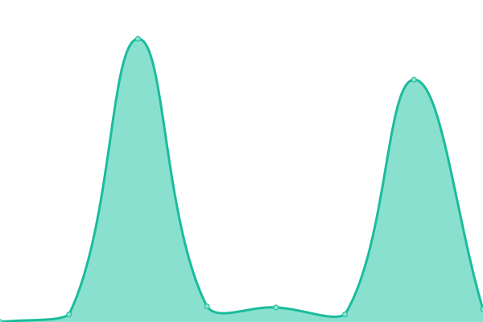
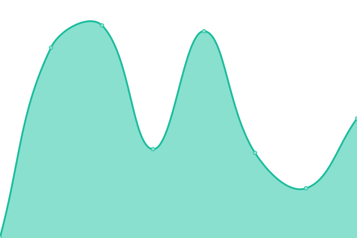

# [📈 Live Status](https://jpleasants.github.io/plesk3): <!--live status--> **🟧 Partial outage**

This repository contains the open-source uptime monitor and status page for [jpleasants](https://jpleasants.github.io/plesk3), powered by [Upptime](https://github.com/upptime/upptime).

With [Upptime](https://upptime.js.org), you can get your own unlimited and free uptime monitor and status page, powered entirely by a GitHub repository. We use [Issues](https://github.com/jpleasants/plesk3/issues) as incident reports, [Actions](https://github.com/jpleasants/plesk3/actions) as uptime monitors, and [Pages](https://jpleasants.github.io/plesk3) for the status page.

<!--start: status pages-->
<!-- This summary is generated by Upptime (https://github.com/upptime/upptime) -->
<!-- Do not edit this manually, your changes will be overwritten -->
<!-- prettier-ignore -->
| URL | Status | History | Response Time | Uptime |
| --- | ------ | ------- | ------------- | ------ |
|  [Plesk 3](https://plesk3.samitsolutions.com) | 🟥 Down | [plesk-3.yml](https://github.com/jpleasants/plesk3/commits/HEAD/history/plesk-3.yml) | 

 297ms
     
 | 

<a href="https://jpleasants.github.io/plesk3/history/plesk-3">89.00%</a>
    

|  [Aexelar](https://aexelar.com) | 🟩 Up | [aexelar.yml](https://github.com/jpleasants/plesk3/commits/HEAD/history/aexelar.yml) | 

 307ms
     
 | 

<a href="https://jpleasants.github.io/plesk3/history/aexelar">98.67%</a>
    

|  [shivji photography](https://shivji.photography) | 🟩 Up | [shivji-photography.yml](https://github.com/jpleasants/plesk3/commits/HEAD/history/shivji-photography.yml) | 

 536ms
     
 | 

<a href="https://jpleasants.github.io/plesk3/history/shivji-photography">99.12%</a>
    

|  [Carolina Heart Center](https://carolinaheartcenter.com) | 🟩 Up | [carolina-heart-center.yml](https://github.com/jpleasants/plesk3/commits/HEAD/history/carolina-heart-center.yml) | 

 294ms
     
 | 

<a href="https://jpleasants.github.io/plesk3/history/carolina-heart-center">98.00%</a>
    

|  [wfendo](https://wfendo.com) | 🟥 Down | [wfendo.yml](https://github.com/jpleasants/plesk3/commits/HEAD/history/wfendo.yml) | 

 1117ms
     
 | 

<a href="https://jpleasants.github.io/plesk3/history/wfendo">98.05%</a>
    

|  [veearprojects](https://veearprojects.com) | 🟩 Up | [veearprojects.yml](https://github.com/jpleasants/plesk3/commits/HEAD/history/veearprojects.yml) | 

 521ms
     
 | 

<a href="https://jpleasants.github.io/plesk3/history/veearprojects">98.89%</a>
    

|  [stone-erp](https://stone-erp.com) | 🟩 Up | [stone-erp.yml](https://github.com/jpleasants/plesk3/commits/HEAD/history/stone-erp.yml) | 

 565ms
     
 | 

<a href="https://jpleasants.github.io/plesk3/history/stone-erp">99.47%</a>
    

|  [nazaranc](https://nazaranc.com) | 🟩 Up | [nazaranc.yml](https://github.com/jpleasants/plesk3/commits/HEAD/history/nazaranc.yml) | 

 1687ms
     
 | 

<a href="https://jpleasants.github.io/plesk3/history/nazaranc">98.20%</a>
    

|  [sergetechmechanical](https://sergetechmechanical.com) | 🟩 Up | [sergetechmechanical.yml](https://github.com/jpleasants/plesk3/commits/HEAD/history/sergetechmechanical.yml) | 

 504ms
     
 | 

<a href="https://jpleasants.github.io/plesk3/history/sergetechmechanical">98.24%</a>
    

|  [vitalmanage](https://vitalmanage.com) | 🟩 Up | [vitalmanage.yml](https://github.com/jpleasants/plesk3/commits/HEAD/history/vitalmanage.yml) | 

 223ms
     
 | 

<a href="https://jpleasants.github.io/plesk3/history/vitalmanage">97.46%</a>
    

|  [Harbor Hat](https://harborhat.com) | 🟩 Up | [harbor-hat.yml](https://github.com/jpleasants/plesk3/commits/HEAD/history/harbor-hat.yml) | 

 1004ms
     
 | 

<a href="https://jpleasants.github.io/plesk3/history/harbor-hat">94.21%</a>
    

|  [KANORS EMR](https://kanors-emr.org) | 🟩 Up | [kanors-emr.yml](https://github.com/jpleasants/plesk3/commits/HEAD/history/kanors-emr.yml) | 

 1439ms
     
 | 

<a href="https://jpleasants.github.io/plesk3/history/kanors-emr">94.29%</a>
    

|  [mymedicalidea](https://mymedicalidea.com) | 🟩 Up | [mymedicalidea.yml](https://github.com/jpleasants/plesk3/commits/HEAD/history/mymedicalidea.yml) | 

 394ms
     
 | 

<a href="https://jpleasants.github.io/plesk3/history/mymedicalidea">99.02%</a>
    

|  [KANORS EMR Helpdesk](https://helpdesk.kanors-emr.org) | 🟩 Up | [kanors-emr-helpdesk.yml](https://github.com/jpleasants/plesk3/commits/HEAD/history/kanors-emr-helpdesk.yml) | 

 240ms
     
 | 

<a href="https://jpleasants.github.io/plesk3/history/kanors-emr-helpdesk">98.98%</a>
    

|  [drpeds](https://drpeds.com) | 🟥 Down | [drpeds.yml](https://github.com/jpleasants/plesk3/commits/HEAD/history/drpeds.yml) | 

 1980ms
     
 | 

<a href="https://jpleasants.github.io/plesk3/history/drpeds">91.50%</a>
    

|  [KANORS EMR Licensing](https://licensing.kanors-emr.org) | 🟩 Up | [kanors-emr-licensing.yml](https://github.com/jpleasants/plesk3/commits/HEAD/history/kanors-emr-licensing.yml) | 

 326ms
     
 | 

<a href="https://jpleasants.github.io/plesk3/history/kanors-emr-licensing">98.69%</a>
    

|  [institrve](https://institrve.com) | 🟩 Up | [institrve.yml](https://github.com/jpleasants/plesk3/commits/HEAD/history/institrve.yml) | 

 1095ms
     
 | 

<a href="https://jpleasants.github.io/plesk3/history/institrve">94.47%</a>
    

|  [marizyme](https://marizyme.com) | 🟥 Down | [marizyme.yml](https://github.com/jpleasants/plesk3/commits/HEAD/history/marizyme.yml) | 

 287ms
     
 | 

<a href="https://jpleasants.github.io/plesk3/history/marizyme">98.64%</a>
    

|  [Nazara NC](https://nazaranc.com) | 🟩 Up | [nazara-nc.yml](https://github.com/jpleasants/plesk3/commits/HEAD/history/nazara-nc.yml) | 

 1208ms
     
 | 

<a href="https://jpleasants.github.io/plesk3/history/nazara-nc">76.87%</a>
    

|  [khannasonsjewelers](https://khannasonsjewelers.com) | 🟩 Up | [khannasonsjewelers.yml](https://github.com/jpleasants/plesk3/commits/HEAD/history/khannasonsjewelers.yml) | 

 361ms
     
 | 

<a href="https://jpleasants.github.io/plesk3/history/khannasonsjewelers">98.26%</a>
    

|  [Shah and Associated FP Portal](https://portal.shahandassociatesfp.com) | 🟩 Up | [shah-and-associated-fp-portal.yml](https://github.com/jpleasants/plesk3/commits/HEAD/history/shah-and-associated-fp-portal.yml) | 

 423ms
     
 | 

<a href="https://jpleasants.github.io/plesk3/history/shah-and-associated-fp-portal">97.18%</a>
    

|  [Shah and Associated FP](https://shahandassociatesfp.com) | 🟩 Up | [shah-and-associated-fp.yml](https://github.com/jpleasants/plesk3/commits/HEAD/history/shah-and-associated-fp.yml) | 

 324ms
     
 | 

<a href="https://jpleasants.github.io/plesk3/history/shah-and-associated-fp">99.35%</a>
    

|  [thepuppie](https://thepuppie.com) | 🟩 Up | [thepuppie.yml](https://github.com/jpleasants/plesk3/commits/HEAD/history/thepuppie.yml) | 

 900ms
     
 | 

<a href="https://jpleasants.github.io/plesk3/history/thepuppie">94.86%</a>
    

|  [peppernc](https://peppernc.com) | 🟩 Up | [peppernc.yml](https://github.com/jpleasants/plesk3/commits/HEAD/history/peppernc.yml) | 

 314ms
     
 | 

<a href="https://jpleasants.github.io/plesk3/history/peppernc">98.77%</a>
    

|  [crowdsourcingsustainability](https://crowdsourcingsustainability.org) | 🟥 Down | [crowdsourcingsustainability.yml](https://github.com/jpleasants/plesk3/commits/HEAD/history/crowdsourcingsustainability.yml) | 

 362ms
     
 | 

<a href="https://jpleasants.github.io/plesk3/history/crowdsourcingsustainability">97.65%</a>
    

|  [zaykauncchapelhill](https://zaykauncchapelhill.com) | 🟩 Up | [zaykauncchapelhill.yml](https://github.com/jpleasants/plesk3/commits/HEAD/history/zaykauncchapelhill.yml) | 

 386ms
     
 | 

<a href="https://jpleasants.github.io/plesk3/history/zaykauncchapelhill">99.31%</a>
    

|  [bharat grocery](https://bharat-grocery.com) | 🟩 Up | [bharat-grocery.yml](https://github.com/jpleasants/plesk3/commits/HEAD/history/bharat-grocery.yml) | 

 211ms
     
 | 

<a href="https://jpleasants.github.io/plesk3/history/bharat-grocery">98.54%</a>
    

|  [KANORS EMR Support](https://support.kanors-emr.org) | 🟩 Up | [kanors-emr-support.yml](https://github.com/jpleasants/plesk3/commits/HEAD/history/kanors-emr-support.yml) | 

 520ms
     
 | 

<a href="https://jpleasants.github.io/plesk3/history/kanors-emr-support">98.70%</a>
    

|  [coalitionforcarolinafoundation](https://coalitionforcarolinafoundation.org) | 🟩 Up | [coalitionforcarolinafoundation.yml](https://github.com/jpleasants/plesk3/commits/HEAD/history/coalitionforcarolinafoundation.yml) | 

 968ms
     
 | 

<a href="https://jpleasants.github.io/plesk3/history/coalitionforcarolinafoundation">95.40%</a>
    

|  [tekrek](https://tekrek.com) | 🟩 Up | [tekrek.yml](https://github.com/jpleasants/plesk3/commits/HEAD/history/tekrek.yml) | 

 189ms
     
 | 

<a href="https://jpleasants.github.io/plesk3/history/tekrek">97.84%</a>
    

|  [directedfacilitysolutions](https://directedfacilitysolutions.com) | 🟩 Up | [directedfacilitysolutions.yml](https://github.com/jpleasants/plesk3/commits/HEAD/history/directedfacilitysolutions.yml) | 

 186ms
     
 | 

<a href="https://jpleasants.github.io/plesk3/history/directedfacilitysolutions">97.48%</a>
    

|  [veearhealth](https://veearhealth.com) | 🟩 Up | [veearhealth.yml](https://github.com/jpleasants/plesk3/commits/HEAD/history/veearhealth.yml) | 

 212ms
     
 | 

<a href="https://jpleasants.github.io/plesk3/history/veearhealth">75.19%</a>
    

<!--end: status pages-->

[**Visit our status website →**](https://jpleasants.github.io/plesk3)

## 📄 License

- Powered by: [Upptime](https://github.com/upptime/upptime)
- Code: [MIT](./LICENSE) © [jpleasants](https://jpleasants.github.io/plesk3)
- Data in the `./history` directory: [Open Database License](https://opendatacommons.org/licenses/odbl/1-0/)
