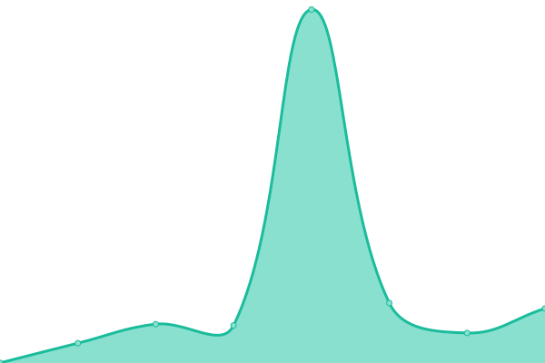

# [📈 Live Status](https://jpleasants.github.io/plesk3): <!--live status--> **🟧 Partial outage**

This repository contains the open-source uptime monitor and status page for [jpleasants](https://jpleasants.github.io/plesk3), powered by [Upptime](https://github.com/upptime/upptime).

With [Upptime](https://upptime.js.org), you can get your own unlimited and free uptime monitor and status page, powered entirely by a GitHub repository. We use [Issues](https://github.com/jpleasants/plesk3/issues) as incident reports, [Actions](https://github.com/jpleasants/plesk3/actions) as uptime monitors, and [Pages](https://jpleasants.github.io/plesk3) for the status page.

<!--start: status pages-->
<!-- This summary is generated by Upptime (https://github.com/upptime/upptime) -->
<!-- Do not edit this manually, your changes will be overwritten -->
<!-- prettier-ignore -->
| URL | Status | History | Response Time | Uptime |
| --- | ------ | ------- | ------------- | ------ |
|  [Plesk 3](https://plesk3.samitsolutions.com) | 🟩 Up | [plesk-3.yml](https://github.com/jpleasants/plesk3/commits/HEAD/history/plesk-3.yml) | 

 399ms
     
 | 

<a href="https://jpleasants.github.io/plesk3/history/plesk-3">88.59%</a>
    

|  [Aexelar](https://aexelar.com) | 🟩 Up | [aexelar.yml](https://github.com/jpleasants/plesk3/commits/HEAD/history/aexelar.yml) | 

 3237ms
     
 | 

<a href="https://jpleasants.github.io/plesk3/history/aexelar">100.00%</a>
    

|  [Apex Food Service](https://apexfoodservice.com) | 🟥 Down | [apex-food-service.yml](https://github.com/jpleasants/plesk3/commits/HEAD/history/apex-food-service.yml) | 

 0ms
     
 | 

<a href="https://jpleasants.github.io/plesk3/history/apex-food-service">0.00%</a>
    

|  [Carolina Heart Center](https://carolinaheartcenter.com) | 🟩 Up | [carolina-heart-center.yml](https://github.com/jpleasants/plesk3/commits/HEAD/history/carolina-heart-center.yml) | 

 2196ms
     
 | 

<a href="https://jpleasants.github.io/plesk3/history/carolina-heart-center">100.00%</a>
    

|  [Control Infotech](https://control-infotech.com) | 🟩 Up | [control-infotech.yml](https://github.com/jpleasants/plesk3/commits/HEAD/history/control-infotech.yml) | 

 260ms
     
 | 

<a href="https://jpleasants.github.io/plesk3/history/control-infotech">100.00%</a>
    

|  [Durant Rd Pediatrics](https://drpeds.com) | 🟩 Up | [durant-rd-pediatrics.yml](https://github.com/jpleasants/plesk3/commits/HEAD/history/durant-rd-pediatrics.yml) | 

 6497ms
     
 | 

<a href="https://jpleasants.github.io/plesk3/history/durant-rd-pediatrics">88.89%</a>
    

|  [Dynpro](https://dynpro.in) | 🟩 Up | [dynpro.yml](https://github.com/jpleasants/plesk3/commits/HEAD/history/dynpro.yml) | 

 3446ms
     
 | 

<a href="https://jpleasants.github.io/plesk3/history/dynpro">100.00%</a>
    

|  [Dynpro India](https://dynproindia.com) | 🟩 Up | [dynpro-india.yml](https://github.com/jpleasants/plesk3/commits/HEAD/history/dynpro-india.yml) | 

 3113ms
     
 | 

<a href="https://jpleasants.github.io/plesk3/history/dynpro-india">100.00%</a>
    

|  [KANORS EMR Forum](https://forum.kanors-emr.org) | 🟩 Up | [kanors-emr-forum.yml](https://github.com/jpleasants/plesk3/commits/HEAD/history/kanors-emr-forum.yml) | 

 825ms
     
 | 

<a href="https://jpleasants.github.io/plesk3/history/kanors-emr-forum">100.00%</a>
    

|  [Fresh Indian Market](https://freshindianmarket.com) | 🟩 Up | [fresh-indian-market.yml](https://github.com/jpleasants/plesk3/commits/HEAD/history/fresh-indian-market.yml) | 

 7656ms
     
 | 

<a href="https://jpleasants.github.io/plesk3/history/fresh-indian-market">100.00%</a>
    

|  [Harbor Hat](https://harborhat.com) | 🟩 Up | [harbor-hat.yml](https://github.com/jpleasants/plesk3/commits/HEAD/history/harbor-hat.yml) | 

 4358ms
     
 | 

<a href="https://jpleasants.github.io/plesk3/history/harbor-hat">100.00%</a>
    

|  [KANORS EMR Helpdesk](https://helpdesk.kanors-emr.org) | 🟩 Up | [kanors-emr-helpdesk.yml](https://github.com/jpleasants/plesk3/commits/HEAD/history/kanors-emr-helpdesk.yml) | 

 255ms
     
 | 

<a href="https://jpleasants.github.io/plesk3/history/kanors-emr-helpdesk">100.00%</a>
    

|  [Institrve](https://institrve.com) | 🟩 Up | [institrve.yml](https://github.com/jpleasants/plesk3/commits/HEAD/history/institrve.yml) | 

 3870ms
     
 | 

<a href="https://jpleasants.github.io/plesk3/history/institrve">100.00%</a>
    

|  [Kanlo Net](https://kanlo.net) | 🟥 Down | [kanlo-net.yml](https://github.com/jpleasants/plesk3/commits/HEAD/history/kanlo-net.yml) | 

 0ms
     
 | 

<a href="https://jpleasants.github.io/plesk3/history/kanlo-net">0.00%</a>
    

|  [KANORS EMR](https://kanors-emr.org) | 🟩 Up | [kanors-emr.yml](https://github.com/jpleasants/plesk3/commits/HEAD/history/kanors-emr.yml) | 

 1911ms
     
 | 

<a href="https://jpleasants.github.io/plesk3/history/kanors-emr">100.00%</a>
    

|  [Khanna Sons Jewelers](https://khannasonsjewelers.com) | 🟩 Up | [khanna-sons-jewelers.yml](https://github.com/jpleasants/plesk3/commits/HEAD/history/khanna-sons-jewelers.yml) | 

 5408ms
     
 | 

<a href="https://jpleasants.github.io/plesk3/history/khanna-sons-jewelers">100.00%</a>
    

|  [KANORS EMR Licensing](https://licensing.kanors-emr.org) | 🟩 Up | [kanors-emr-licensing.yml](https://github.com/jpleasants/plesk3/commits/HEAD/history/kanors-emr-licensing.yml) | 

 203ms
     
 | 

<a href="https://jpleasants.github.io/plesk3/history/kanors-emr-licensing">100.00%</a>
    

|  [Lj Neurology](https://ljneurology.com) | 🟩 Up | [lj-neurology.yml](https://github.com/jpleasants/plesk3/commits/HEAD/history/lj-neurology.yml) | 

 254ms
     
 | 

<a href="https://jpleasants.github.io/plesk3/history/lj-neurology">100.00%</a>
    

|  [Marizyme](https://marizyme.com) | 🟩 Up | [marizyme.yml](https://github.com/jpleasants/plesk3/commits/HEAD/history/marizyme.yml) | 

 499ms
     
 | 

<a href="https://jpleasants.github.io/plesk3/history/marizyme">100.00%</a>
    

|  [My Medical Idea](https://mymedicalidea.com) | 🟩 Up | [my-medical-idea.yml](https://github.com/jpleasants/plesk3/commits/HEAD/history/my-medical-idea.yml) | 

 3442ms
     
 | 

<a href="https://jpleasants.github.io/plesk3/history/my-medical-idea">89.41%</a>
    

|  [Nazara NC](https://nazaranc.com) | 🟩 Up | [nazara-nc.yml](https://github.com/jpleasants/plesk3/commits/HEAD/history/nazara-nc.yml) | 

 4344ms
     
 | 

<a href="https://jpleasants.github.io/plesk3/history/nazara-nc">100.00%</a>
    

|  [Patty4 Morrisville](https://patty4morrisville.com) | 🟩 Up | [patty4-morrisville.yml](https://github.com/jpleasants/plesk3/commits/HEAD/history/patty4-morrisville.yml) | 

 384ms
     
 | 

<a href="https://jpleasants.github.io/plesk3/history/patty4-morrisville">100.00%</a>
    

|  [Shah and Associated FP Portal](https://portal.shahandassociatesfp.com) | 🟩 Up | [shah-and-associated-fp-portal.yml](https://github.com/jpleasants/plesk3/commits/HEAD/history/shah-and-associated-fp-portal.yml) | 

 2687ms
     
 | 

<a href="https://jpleasants.github.io/plesk3/history/shah-and-associated-fp-portal">100.00%</a>
    

|  [Serge Tech Mechanical](https://sergetechmechanical.com) | 🟩 Up | [serge-tech-mechanical.yml](https://github.com/jpleasants/plesk3/commits/HEAD/history/serge-tech-mechanical.yml) | 

 255ms
     
 | 

<a href="https://jpleasants.github.io/plesk3/history/serge-tech-mechanical">100.00%</a>
    

|  [Shah and Associated FP](https://shahandassociatesfp.com) | 🟩 Up | [shah-and-associated-fp.yml](https://github.com/jpleasants/plesk3/commits/HEAD/history/shah-and-associated-fp.yml) | 

 12793ms
     
 | 

<a href="https://jpleasants.github.io/plesk3/history/shah-and-associated-fp">100.00%</a>
    

|  [Shivji Photography](https://shivji.photography) | 🟩 Up | [shivji-photography.yml](https://github.com/jpleasants/plesk3/commits/HEAD/history/shivji-photography.yml) | 

 4200ms
     
 | 

<a href="https://jpleasants.github.io/plesk3/history/shivji-photography">0.00%</a>
    

|  [Sizzlin Stir Fry](https://sizzlinstirfry.com) | 🟩 Up | [sizzlin-stir-fry.yml](https://github.com/jpleasants/plesk3/commits/HEAD/history/sizzlin-stir-fry.yml) | 

 3303ms
     
 | 

<a href="https://jpleasants.github.io/plesk3/history/sizzlin-stir-fry">0.00%</a>
    

|  [Sleep Clinic Of Ohio](https://sleepclinicofohio.com) | 🟩 Up | [sleep-clinic-of-ohio.yml](https://github.com/jpleasants/plesk3/commits/HEAD/history/sleep-clinic-of-ohio.yml) | 

 7178ms
     
 | 

<a href="https://jpleasants.github.io/plesk3/history/sleep-clinic-of-ohio">100.00%</a>
    

|  [Peoples Medical Care Staging](https://staging.peoplesmedicalcare.org) | 🟩 Up | [peoples-medical-care-staging.yml](https://github.com/jpleasants/plesk3/commits/HEAD/history/peoples-medical-care-staging.yml) | 

 3001ms
     
 | 

<a href="https://jpleasants.github.io/plesk3/history/peoples-medical-care-staging">100.00%</a>
    

|  [Stone ERP](https://stone-erp.com) | 🟩 Up | [stone-erp.yml](https://github.com/jpleasants/plesk3/commits/HEAD/history/stone-erp.yml) | 

 2361ms
     
 | 

<a href="https://jpleasants.github.io/plesk3/history/stone-erp">100.00%</a>
    

|  [KANORS EMR Support](https://support.kanors-emr.org) | 🟩 Up | [kanors-emr-support.yml](https://github.com/jpleasants/plesk3/commits/HEAD/history/kanors-emr-support.yml) | 

 193ms
     
 | 

<a href="https://jpleasants.github.io/plesk3/history/kanors-emr-support">0.00%</a>
    

|  [Teampro India](https://Teamproindia.com) | 🟩 Up | [teampro-india.yml](https://github.com/jpleasants/plesk3/commits/HEAD/history/teampro-india.yml) | 

 198ms
     
 | 

<a href="https://jpleasants.github.io/plesk3/history/teampro-india">0.00%</a>
    

|  [Thought Leader Select](https://thoughtleaderselect.com) | 🟩 Up | [thought-leader-select.yml](https://github.com/jpleasants/plesk3/commits/HEAD/history/thought-leader-select.yml) | 

 429ms
     
 | 

<a href="https://jpleasants.github.io/plesk3/history/thought-leader-select">100.00%</a>
    

|  [Veear Projects](https://veearprojects.com) | 🟩 Up | [veear-projects.yml](https://github.com/jpleasants/plesk3/commits/HEAD/history/veear-projects.yml) | 

 1417ms
     
 | 

<a href="https://jpleasants.github.io/plesk3/history/veear-projects">90.79%</a>
    

|  [Vital Manage](https://vitalmanage.com) | 🟩 Up | [vital-manage.yml](https://github.com/jpleasants/plesk3/commits/HEAD/history/vital-manage.yml) | 

 270ms
     
 | 

<a href="https://jpleasants.github.io/plesk3/history/vital-manage">100.00%</a>
    

|  [Wake Forest Endoscopy](https://wfendo.com) | 🟩 Up | [wake-forest-endoscopy.yml](https://github.com/jpleasants/plesk3/commits/HEAD/history/wake-forest-endoscopy.yml) | 

 1766ms
     
 | 

<a href="https://jpleasants.github.io/plesk3/history/wake-forest-endoscopy">100.00%</a>
    

<!--end: status pages-->

[**Visit our status website →**](https://jpleasants.github.io/plesk3)

## 📄 License

- Powered by: [Upptime](https://github.com/upptime/upptime)
- Code: [MIT](./LICENSE) © [jpleasants](https://jpleasants.github.io/plesk3)
- Data in the `./history` directory: [Open Database License](https://opendatacommons.org/licenses/odbl/1-0/)
